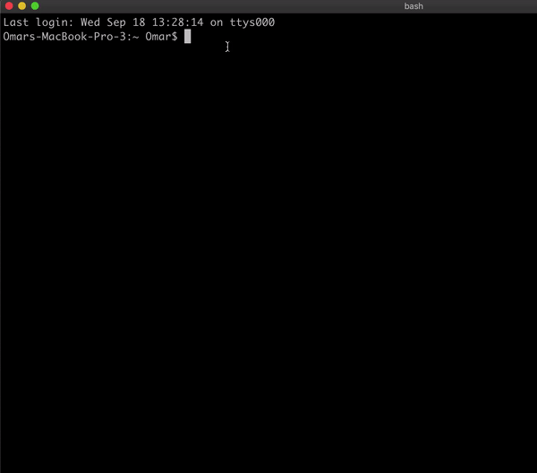

# Virtual Data Center

 <p align="center">
  
</p>

## Introduction
In this tutorial we will make our own Virtual Data Center Service using Bluvalt Cloud.

### Virtual Data Center
Virtual Data Center is a form of cloud computing that provides virtualized computing resources over the Internet
## Prerequisites
* [Bluvalt Cloud Account](https://cloud.bluvalt.com/#/register "Bluvalt Cloud")
 


## Lab Steps
### 1. Create [Virtual Data Center ](https://cloud.bluvalt.com/#/virtual-data-center/ "Virtual Data Center ") Service


### 2. Accsess to VDC Service 


### 3. Creating a Virtual Router - [Video Guide](https://kb.bluvalt.com/uploads/Create_router.mp4 "Video Guide")
```
Router Name = Router 1
```

### 4. Creating a Virtual Network - [Video Guide](https://kb.bluvalt.com/uploads/create_network.mp4 "Video Guide")
```
Network Name = Network 1
Subnet Name = Subnet 1-1
Network Address = 10.10.10.0/24
```


### 5. Creating a Security Group
A security group is a named collection of network access rules that are use to limit the types of traffic that have access to instances. When you launch an instance, you can assign one or more security groups to it. 

```
Note*
For this Tutorial we will allow all traffic so is not recommended for real application.
```


 ```
 Security Name = Security Group 1
 Rule = ALL TCP
 ```

### 6. Creating a Key Pairs

```
Key Pairs Name = KeyPair
```

### 7. Creating or Launching a Virtual Instance - [Video Guide](https://youtu.be/Z7Q5n6i7dHI "Video Guide")

```
Note*
For this Tutorial we will Select Ubuntu-18.04-LTS Image, You can select anything you want.
```

```
Instance Name = Instance 1
Availability Zone = zone-1
Count = 1
Boot Source = Image
Volume Size = 60
Select Image = Ubuntu-18.04-LTS
Flavors = R1-Generic-1
Networks = Network 1
Security groups =  security groups 1
Key Pairs = Key Pairs 1 
```


### 8 Assign Floating IP to The Instance 


### 9 connecting to The Virtual Instance  
```
Note*
For this Tutorial we will connect to Ubuntu-18.04-LTS
```
For every Image there a way to connect them please visit The [Knowledge base](https://kb.bluvalt.com/ "Knowledge base") for more information



Open the Terminal and Enter:
```
sudo su 
ssh -i [path of key pair ]/keypair.pem ubuntu@[floatingip] 
```
Example: ssh -i /Users/Omar/Downloads/keypair.pem ubuntu@95.177.166.233


## Conclusion 
Congratulations! You now have your own Virtual Data Center Service. You can start deploy your Applcations in the cloud!.

