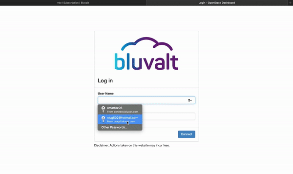

# Virtual Data Center

 <p align="center">
  
</p>

## Introduction
In this tutorial we will make our own Virtual Data Center Service and deploy inside it a linux server, using Bluvalt Cloud.

### Virtual Data Center
Virtual Data Center is a form of cloud computing that provides virtualized computing resources over the Internet
## Prerequisites
* [Bluvalt Cloud Account](https://cloud.bluvalt.com/#/register "Bluvalt Cloud")
 


## Lab Steps
### 1. Create [Virtual Data Center ](https://cloud.bluvalt.com/#/virtual-data-center/ "Virtual Data Center ") Service


### 2. Accsess to VDC Service 



### 3. Creating a Virtual Router - [Video Guide](https://kb.bluvalt.com/uploads/Create_router.mp4 "Video Guide")
```
Router Name = Router 1
```

### 4. Creating a Virtual Network - [Video Guide](https://kb.bluvalt.com/uploads/create_network.mp4 "Video Guide")
```
Network Name = Network 1
Subnet Name = Subnet 1-1
Network Address = 10.10.10.0/24
```


### 5. Creating a Security Groups


 ```
 Security Name = Security Group 1
 Rule = ALLTCP
 ```

### 6. Creating a Key Pairs

```
Key Pairs Name = KeyPair
```

### 7. Creating or Launching a Virtual Instance - [Video Guide](https://youtu.be/KsT46ramxqY "Video Guide")

```
Instance Name = Instance 1
Availability Zone = zone-1
Count = 1
Boot Source = Image
Volume Size = 60
Select Image = Ubuntu-18.04-LTS
Flavors = R1-Generic-1
Networks = Network 1
Security groups =  security groups 1
Key Pairs = Key Pairs 1 
```

### 8 Assign Floating IP to The Instance 


### 9 connecting to The Virtual Instance  


open the Terminal and enter:
```
sudo su 
ssh -i [path of key pair ]/keypair.pem ubuntu@[floatingip] 
```
example: ssh -i /Users/Omar/Downloads/keypair.pem ubuntu@95.177.166.233


## Conclusion 
Congratulations! You now have your own Virtual Data Center Service. You can start deploy your Applcations in the cloud !.

